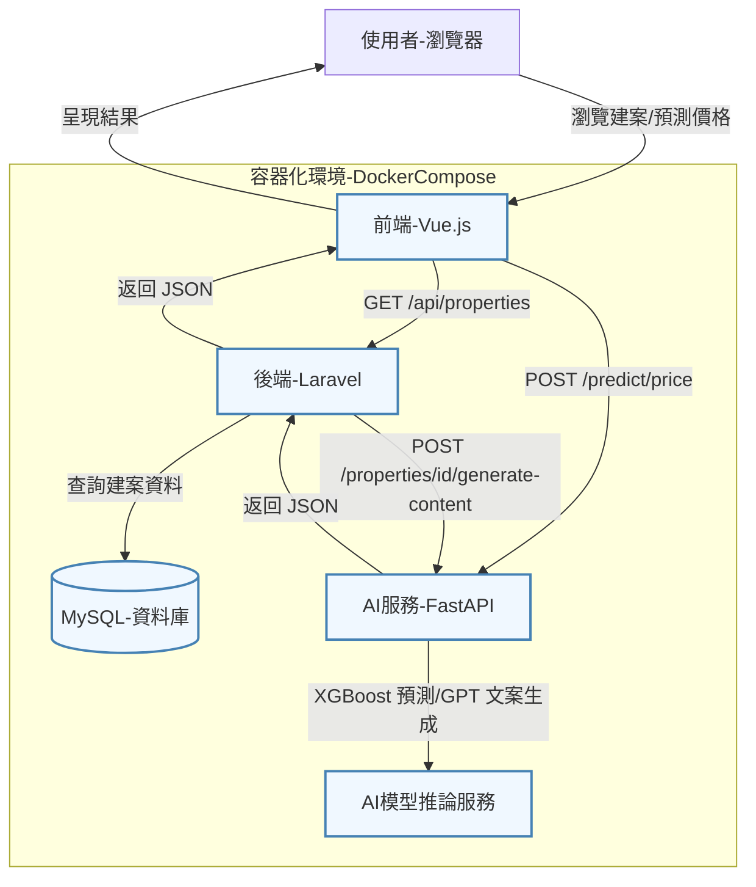

# 智慧房地產系統

**智慧房地產系統** 是一個先進的房地產科技（PropTech）解決方案，結合 AI、大數據和微服務架構，推動傳統房地產產業的數位轉型。本系統提供房價預測、自動化文案生成和建案管理功能，支援 B2B 訂閱制 SaaS 模式與 B2C 銷售平台，適用於房地產企業、開發商和最終用戶。採用模組化設計與 Docker 容器化部署，系統具備高可擴展性，適合與 PropTech 企業合作，打造房地產科技生態圈。

## 功能特性

- **AI 驅動房價預測**：利用 XGBoost 模型，基於面積、地址等特徵提供精準房價預測，支援 B2C 買家決策與 B2B 市場分析。
- **自動化文案生成**：整合 OpenAI API，生成吸引人的建案行銷文案，優化行銷效率與用戶體驗。
- **建案管理**：提供分頁式建案列表、詳情檢視和 Google Maps 地圖整合，簡化房地產資訊管理。
- **B2B SaaS 模式**：模組化 API 設計，支援訂閱制服務，易於與企業客戶的現有系統整合。
- **安全性與合規性**：API 金鑰驗證、CORS 配置和環境變數管理，確保資料安全與合規。
- **容器化部署**：透過 Docker Compose 實現一致性部署，支援快速擴展與雲端整合。

## 技術棧

- **前端**：Vue.js 3、Vite、Tailwind CSS、Axios、Vue Router
- **後端**：Laravel 11（PHP 8.3）、GuzzleHttp
- **AI 服務**：FastAPI（Python 3.10）、Uvicorn、Pandas、Scikit-learn、XGBoost、OpenAI
- **資料庫**：MySQL 8.0
- **容器化**：Docker、Docker Compose
- **其他**：Nginx、Supervisor

## 系統架構

本系統採用微服務架構，所有組件運行於 Docker 容器中，確保環境一致性與可擴展性。以下是系統互動流程圖：



## 關鍵代碼範例

### 前端：建案列表組件（Vue.js）

位於 `frontend/src/pages/HomePage.vue`，展示如何從後端獲取建案列表並實現分頁功能，支援 B2C 用戶體驗。

```vue
<template>
  <div class="homepage">
    <h1 class="text-4xl font-extrabold text-gray-900 mb-8 text-center">建案列表</h1>

    <!-- 顯示載入中狀態，提升用戶體驗 -->
    <div v-if="isLoading" class="text-center text-gray-600 py-10">
      <p class="text-xl font-semibold">正在載入建案資料...</p>
      <div class="mt-4 animate-pulse">
        <div class="h-4 bg-gray-200 rounded w-1/4 mx-auto"></div>
      </div>
    </div>

    <!-- 顯示錯誤訊息，確保錯誤處理清晰 -->
    <div v-if="error" class="error-alert mb-8">
      <strong class="font-bold">載入建案失敗:</strong>
      <span class="block sm:inline">{{ error }}</span>
    </div>

    <!-- 建案卡片列表，支援響應式設計 -->
    <div v-if="!isLoading && !error && properties.length > 0" class="grid grid-cols-1 md:grid-cols-2 lg:grid-cols-3 gap-8">
      <div v-for="property in properties" :key="property.id" class="card bg-white rounded-lg shadow-lg overflow-hidden transition-transform transform hover:scale-105 duration-300">
        <router-link :to="`/properties/${property.id}`">
          
          <div class="p-6">
            <h2 class="text-2xl font-bold text-gray-900 truncate">{{ property.address }}</h2>
            <p class="text-gray-600 mt-2">面積: {{ property.area }} 坪</p>
            <p class="text-3xl font-bold text-blue-600 mt-2">NT$ {{ formatPrice(property.price) }} 萬</p>
          </div>
        </router-link>
      </div>
    </div>

    <!-- 分頁控制，支援動態頁數切換 -->
    <div v-if="totalPages > 1" class="pagination-controls flex flex-col sm:flex-row justify-between items-center mt-12 space-y-4 sm:space-y-0">
      <div class="flex items-center space-x-2">
        <button
          @click="changePage(currentPage - 1)"
          :disabled="currentPage <= 1"
          class="btn-pagination"
        >
          上一頁
        </button>
        <button
          v-for="page in totalPages"
          :key="page"
          @click="changePage(page)"
          :class="['btn-pagination', { 'active': page === currentPage }]"
        >
          {{ page }}
        </button>
        <button
          @click="changePage(currentPage + 1)"
          :disabled="currentPage >= totalPages"
          class="btn-pagination"
        >
          下一頁
        </button>
      </div>
      <span class="text-lg font-medium text-gray-700">頁數 {{ currentPage }} / {{ totalPages }} (共 {{ totalRecords }} 筆記錄)</span>
    </div>
  </div>
</template>

<script setup>
import { ref, onMounted } from 'vue';
import axios from 'axios';

// 狀態管理
const properties = ref([]); // 儲存建案列表
const isLoading = ref(true); // 控制載入狀態
const error = ref(null); // 儲存錯誤訊息
const currentPage = ref(1); // 當前頁碼
const totalPages = ref(1); // 總頁數
const totalRecords = ref(0); // 總記錄數
const perPage = ref(10); // 每頁記錄數

// 從後端獲取建案資料，支援 B2C 平台展示
const fetchProperties = async (page) => {
  isLoading.value = true;
  error.value = null;
  try {
    // 發送 GET 請求到後端 API，包含分頁參數
    const response = await axios.get(`/properties?page=${page}&per_page=${perPage.value}`);
    properties.value = response.data.data;
    const meta = response.data.meta;
    currentPage.value = meta.current_page;
    totalPages.value = meta.last_page;
    totalRecords.value = meta.total;
  } catch (err) {
    console.error('Failed to fetch properties:', err);
    error.value = err.message || '無法從伺服器載入資料。';
  } finally {
    isLoading.value = false;
  }
};

// 切換頁面，優化用戶瀏覽體驗
const changePage = (page) => {
  if (page > 0 && page <= totalPages.value) {
    fetchProperties(page);
  }
};

// 格式化價格顯示，符合台灣市場習慣
const formatPrice = (price) => {
  return parseFloat(price).toLocaleString('en-US', { minimumFractionDigits: 2, maximumFractionDigits: 2 });
};

// 組件掛載時載入第一頁資料
onMounted(() => {
  fetchProperties(currentPage.value);
});
</script>
```

### 後端：建案控制器（Laravel）

位於 `backend-laravel/app/Http/Controllers/PropertyController.php`，展示如何處理建案列表和詳情 API，支援 B2B 訂閱制客戶。

```php
<?php

namespace App\Http\Controllers;

use Illuminate\Http\Request;
use App\Models\Property;
use Illuminate\Support\Facades\Http;
use Illuminate\Support\Facades\Log;

class PropertyController extends Controller
{
    /**
     * 獲取建案列表，支援分頁，適用於 B2B SaaS 平台
     * @param \Illuminate\Http\Request $request
     * @return \Illuminate\Http\JsonResponse
     */
    public function index(Request $request)
    {
        try {
            // 從查詢參數獲取頁碼和每頁數量
            $page = $request->query('page', 1);
            $limit = $request->query('limit', 10);

            // 使用 Laravel 的分頁功能查詢建案
            $properties = Property::paginate($limit, ['*'], 'page', $page);
            
            // 返回 JSON 格式的響應，包含建案數據和分頁元數據
            return response()->json([
                'data' => $properties->items(),
                'meta' => [
                    'current_page' => $properties->currentPage(),
                    'total' => $properties->total(),
                    'per_page' => (int) $properties->perPage(),
                    'last_page' => $properties->lastPage(),
                ]
            ]);
        } catch (\Exception $e) {
            Log::error('Failed to get property list: ' . $e->getMessage());
            return response()->json(['error' => '無法取得建案資料，請稍後再試。'], 500);
        }
    }

    /**
     * 獲取單一建案詳情，支援 B2C 平台展示
     * @param int $id
     * @return \Illuminate\Http\JsonResponse
     */
    public function show($id)
    {
        try {
            // 根據 ID 查找建案，若不存在則拋出 404
            $property = Property::findOrFail($id);
            return response()->json($property);
        } catch (\Illuminate\Database\Eloquent\ModelNotFoundException $e) {
            return response()->json(['error' => '找不到指定的建案。'], 404);
        } catch (\Exception $e) {
            Log::error("Failed to get property ID:{$id} details: " . $e->getMessage());
            return response()->json(['error' => '無法取得建案詳情，請稍後再試。'], 500);
        }
    }
}
```

### AI 服務：房價預測（FastAPI）

位於 `ai-services-fastapi/routers/predict.py`，展示 AI 驅動的房價預測邏輯，吸引 PropTech 企業的技術團隊。

```python
from fastapi import APIRouter, HTTPException
from pydantic import BaseModel
import pandas as pd
import joblib
import os
import logging

# 配置日誌記錄
logger = logging.getLogger(__name__)

# 定義請求數據模型，支援結構化輸入
class PredictionRequest(BaseModel):
    area: float  # 房屋面積（坪）
    address: str  # 地址或區域
    num_rooms: int = 3  # 房間數（預設值）
    num_bathrooms: int = 2  # 浴室數（預設值）
    age: int = 10  # 建築年齡（預設值）
    location_factor: float = 1.0  # 地理位置影響因子（預設值）
    is_near_mrt: int = 0  # 是否靠近捷運（預設值）

router = APIRouter(
    prefix="/predict",
    tags=["房價預測"]
)

# 載入預訓練模型，支援 AI 驅動功能
MODEL_PATH = os.path.join(os.path.dirname(__file__), '../models/model_xgb.pkl')
MODEL = None
try:
    if os.path.exists(MODEL_PATH):
        MODEL = joblib.load(MODEL_PATH)
        logger.info(f"✅ 成功載入預測模型: {MODEL_PATH}")
    else:
        logger.warning(f"❌ 模型檔案不存在於 {MODEL_PATH}，將使用模擬預測。")
except Exception as e:
    logger.error(f"❌ 載入模型失敗: {e}，將使用模擬預測。")

@router.post("/price", summary="預測房價")
def predict_price(data: PredictionRequest):
    """
    根據面積和地址預測房價，支援 B2B 與 B2C 應用
    - area: 房屋面積（坪）
    - address: 房屋地址或區域
    """
    if data.area <= 0:
        logger.error(f"無效的面積輸入: {data.area}")
        raise HTTPException(status_code=400, detail="面積必須是大於零的數值。")
    
    predicted_price_in_ten_thousand = 0.0

    if MODEL:
        try:
            # 根據地址模擬地理位置因子，適應台灣市場
            location_factor = 1.0
            is_near_mrt = 0
            if '大安區' in data.address or '信義區' in data.address:
                location_factor = 1.5
                is_near_mrt = 1
            elif '中山區' in data.address:
                location_factor = 1.2
            
            # 準備模型輸入數據
            input_data = pd.DataFrame([[data.area, data.num_rooms, data.num_bathrooms, data.age, location_factor, is_near_mrt]],
                                    columns=['area', 'num_rooms', 'num_bathrooms', 'age', 'location_factor', 'is_near_mrt'])
            
            # 使用模型進行預測
            predicted_price_in_ten_thousand = MODEL.predict(input_data)[0]
            logger.info(f"成功使用模型預測價格：{predicted_price_in_ten_thousand} 萬")
        except Exception as e:
            logger.warning(f"⚠️ 模型預測失敗: {e}，退回模擬邏輯。")
            # 模擬預測邏輯
            base_price_per_ping = 150 if '大安區' in data.address or '信義區' in data.address else 80
            predicted_price_in_ten_thousand = data.area * base_price_per_ping
    else:
        # 若無模型，使用模擬邏輯，確保服務可用性
        base_price_per_ping = 80
        if '大安區' in data.address or '信義區' in data.address:
            base_price_per_ping = 150
        elif '中山區' in data.address or '松山區' in data.address:
            base_price_per_ping = 120
        elif '文山區' in data.address or '北投區' in data.address:
            base_price_per_ping = 70
        
        predicted_price_in_ten_thousand = data.area * base_price_per_ping
        logger.info(f"使用模擬邏輯預測價格：{predicted_price_in_ten_thousand} 萬")

    # 返回四捨五入後的價格（單位：萬台幣）
    return {"predicted_price": round(float(predicted_price_in_ten_thousand), 2)}
```

## 快速開始

**注意**：本倉庫僅包含核心代碼（前端、AI 服務、資料庫結構、後端控制器等），不包含完整的 Laravel 框架代碼。使用者需自行安裝 Laravel 並將核心代碼整合至 Laravel 專案。以下為完整安裝與部署步驟，確保快速展示成果。

### 前置條件

- **Docker Desktop**：包含 Docker Engine 和 Docker Compose。[下載 Docker Desktop](https://docs.docker.com/get-docker/)。
- **PHP 8.3**：用於運行 Laravel。[安裝 PHP](https://www.php.net/downloads.php)。
- **Composer**：PHP 依賴管理工具。[安裝 Composer](https://getcomposer.org/download/)。
- **Node.js 20.x**：用於前端 Vite 構建。[安裝 Node.js](https://nodejs.org/)。
- **Python 3.10**：用於 FastAPI AI 服務。[安裝 Python](https://www.python.org/downloads/)。
- 確保 Docker 守護進程正在運行。

### 安裝與部署

1. **複製專案程式碼**：
   ```bash
   git clone https://github.com/BpsEason/smart-realestate-system.git
   cd smart-realestate-system
   ```

2. **安裝 Laravel 框架**：
   - 創建一個新的 Laravel 專案（若尚未存在）：
     ```bash
     composer create-project laravel/laravel backend-laravel
     ```
   - 將倉庫中的核心代碼（`backend-laravel/app/`, `backend-laravel/database/`, `backend-laravel/routes/` 等）複製到新創建的 Laravel 專案：
     ```bash
     cp -r backend-laravel/app backend-laravel/database backend-laravel/routes <您的Laravel專案路徑>/
     ```

3. **安裝 Laravel 依賴**：
   - 進入 Laravel 專案目錄：
     ```bash
     cd <您的Laravel專案路徑>
     composer install
     ```

4. **配置環境變數**：
   - 複製 `.env.example` 為 `.env`：
     ```bash
     cp .env.example .env
     ```
   - 編輯 `.env` 檔案，設置以下關鍵變數：
     ```env
     API_KEY_SECRET=your_api_key_secret
     AI_SERVICE_INTERNAL_API_KEY=your_ai_service_key
     OPENAI_API_KEY=your_openai_api_key
     VITE_GOOGLE_MAPS_API_KEY=your_google_maps_api_key
     DB_CONNECTION=mysql
     DB_HOST=db
     DB_PORT=3306
     DB_DATABASE=realestate
     DB_USERNAME=root
     DB_PASSWORD=your_password
     ```

5. **安裝前端依賴**：
   - 進入 `frontend/` 目錄：
     ```bash
     cd frontend
     npm install
     ```

6. **安裝 AI 服務依賴**：
   - 進入 `ai-services-fastapi/` 目錄：
     ```bash
     cd ai-services-fastapi
     pip install -r requirements.txt
     ```

7. **建構並啟動 Docker 容器**：
   - 返回專案根目錄，確保 `docker-compose.yml` 配置正確，然後運行：
     ```bash
     docker-compose up --build -d
     ```

8. **執行 Laravel 資料庫遷移與填充**：
   - 在 Laravel 專案目錄中運行：
     ```bash
     docker-compose exec backend php artisan migrate --seed
     ```

9. **訪問應用程式**：
   - 前端：`http://localhost:3000`
   - 後端 API：`http://localhost:8000/api`
   - AI 服務 API：`http://localhost:8001`

## API 文件

詳細的 REST API 規格請參考 [docs/api-design.md](docs/api-design.md)。主要端點包括：

- **建案列表**：`GET /api/properties`（支援分頁，適用於 B2B 客戶）
- **建案詳情**：`GET /api/properties/{id}`（支援 B2C 展示）
- **生成文案**：`POST /api/properties/{id}/generate-content`（AI 驅動行銷）
- **房價預測**：`POST /predict/price`（AI 服務，支援 B2B 與 B2C）
- **健康檢查**：`GET /api/health`

所有後端 API 請求需包含 `X-API-KEY` 標頭，AI 服務 API 需包含 `X-API-KEY`（內部金鑰），確保安全性和合規性。

## FAQ

以下是針對開發者的常見問題與解答，幫助技術團隊快速了解專案架構與實作細節。

### 這個專案的整體架構和核心功能是什麼？

本專案採用微服務架構，包含三個核心服務：前端（Vue.js 3）、後端（Laravel 11）和 AI 服務（FastAPI）。所有服務透過 Docker 容器化部署，由 Docker Compose 管理，確保環境一致性與可擴展性。核心功能包括：

- **房產管理**：提供分頁式建案列表、詳情檢視，整合 Google Maps 展示位置資訊。
- **AI 房價預測**：使用 XGBoost 模型，基於面積、地址等特徵進行精準房價預測，支援 B2C 買家與 B2B 分析。
- **自動化文案生成**：整合 OpenAI API，生成吸引人的建案行銷文案，提升行銷效率。
- **安全性與監控**：實現 API 金鑰驗證與健康檢查端點，確保系統安全與穩定。

微服務架構允許各服務獨立開發與部署，提升靈活性與擴展性，適合 PropTech 應用場景。

### 為什麼選擇微服務架構？有哪些優勢與挑戰？

選擇微服務架構是為了實現高可擴展性、獨立部署與技術異構性。具體優勢包括：

- **獨立開發與部署**：各服務可由不同團隊獨立維護，互不干擾，加速開發週期。
- **技術靈活性**：AI 服務使用 Python/FastAPI 適應機器學習需求，後端使用 PHP/Laravel 處理業務邏輯。
- **可擴展性**：可針對高負載服務（如 AI 預測）單獨擴展，不影響其他組件。

挑戰包括：

- **服務間通訊**：需處理 API 路由、錯誤處理與金鑰驗證，增加複雜性。
- **資料一致性**：微服務間的資料同步與事務管理需謹慎設計。
- **監控需求**：需要集中化日誌與監控系統來追蹤問題。

### Docker 和 Docker Compose 在專案中如何應用？

Docker 和 Docker Compose 是專案的核心部署工具：

- **環境一致性**：Docker 通過 Dockerfile 定義每個服務的運行環境，確保開發、測試與生產環境一致，避免「在我機器上能跑」的問題。
- **環境隔離**：各服務運行於獨立容器，防止依賴衝突。
- **簡化部署**：`docker-compose.yml` 定義服務間關係、埠映射與網路配置，通過單一命令 `docker-compose up -d` 即可啟動所有服務，簡化部署流程並加速新開發者上手。

### 在前端（HomePage.vue）中，如何處理建案列表的載入狀態、錯誤處理與分頁？

在 `frontend/src/pages/HomePage.vue` 中，使用 Vue 3 的 `ref` 管理響應式狀態：

- **載入狀態**：透過 `isLoading` 追蹤資料載入，顯示「正在載入…」提示，提升用戶體驗。
- **錯誤處理**：使用 `try-catch` 捕獲 `axios` 請求錯誤，將錯誤訊息存於 `error` 狀態，並以統一的 `error-alert` 樣式展示。
- **分頁**：後端 API 提供分頁元數據（`current_page`、`total` 等），前端動態渲染分頁按鈕，支援「上一頁/下一頁」功能，並根據狀態禁用按鈕，確保流暢的用戶體驗。

### 為什麼在前端圖片標籤中使用 onerror 處理？如何進一步優化圖片載入？

在 `` 標籤中添加 `onerror="this.onerror=null;this.src='https://placehold.co/800x600/E0F2F7/4299E1?text=無圖片';"`，確保圖片載入失敗時顯示占位圖，避免破碎圖標，提升視覺體驗。`this.onerror=null` 防止無限循環報錯。

其他優化方式包括：

- **懶載入**：使用 `loading="lazy"` 或 Intersection Observer API，減少初始載入時間。
- **響應式圖片**：透過 `<picture>` 與 `srcset` 提供不同尺寸的圖片，適應設備需求。
- **圖片壓縮**：採用 WebP 格式或壓縮工具，降低檔案大小。
- **CDN 加速**：使用內容分發網路提升圖片載入速度。

### 在 Laravel 後端，如何實現 API 金鑰驗證？為什麼選擇 Middleware？

API 金鑰驗證透過自定義的 `ApiKeyMiddleware` 實現，應用於需要保護的路由：

- **統一邏輯**：Middleware 在請求進入 Controller 前驗證金鑰，遵循 DRY 原則，避免重複代碼。
- **安全性**：提前攔截未授權請求，降低業務邏輯層風險。
- **可維護性**：驗證邏輯集中於 Middleware，便於未來修改（如切換 Redis 驗證）。

### /health 端點如何運作？為什麼模擬 AI 服務輸入？

`/health` 端點檢查後端與依賴服務的狀態：

- **資料庫連線**：驗證 MySQL PDO 連線是否正常。
- **AI 服務功能**：模擬真實輸入（如面積、地址）呼叫 `/predict/price`，確保 AI 服務不僅可達，且核心預測功能正常。

模擬真實輸入的目的是進行深度健康檢查，及早發現模型載入失敗或邏輯錯誤，確保系統穩定性。

### 在 AI 服務中，如何處理模型載入與失效情況？

在 `ai-services-fastapi/routers/predict.py` 中，使用 `joblib` 載入 XGBoost 模型：

- **載入流程**：透過 `try-except` 檢查 `model_xgb.pkl` 是否存在並可載入。
- **失效處理**：若模型檔案缺失或載入失敗，記錄警告日誌並切換至模擬預測邏輯，確保服務不中斷。
- **設計考量**：模擬邏輯保證服務可用性，同時日誌記錄便於運維排查問題，適合生產環境的穩定性需求。

### FastAPI 的 API 金鑰驗證與 Laravel 有何不同？為什麼需要兩層驗證？

- **Laravel 驗證**：保護前端與外部客戶端的 API 請求，確保授權訪問。
- **FastAPI 驗證**：作為內部服務間安全層，驗證來自 Laravel 的請求，防止未授權直接呼叫。

兩層驗證實現了多層次安全防禦，確保即使後端被攻破，AI 服務仍受保護。同時，細粒度金鑰允許未來針對不同服務設置獨立策略。

### 為什麼在資料庫中添加 idx_area_price 複合索引？

`idx_area_price` 複合索引優化 `properties` 表的查詢效率：

- **好處**：加速 `WHERE area > X AND price < Y` 或 `ORDER BY price` 的查詢，減少全表掃描。
- **設計原則**：根據常見查詢模式（WHERE、JOIN、ORDER BY）與欄位基數選擇索引，平衡查詢性能與儲存成本。

### schema.sql 與 php artisan migrate --seed 的關係與區別？

- **schema.sql**：複製至 `/docker-entrypoint-initdb.d/`，由 MySQL 容器首次啟動時自動執行，快速初始化資料庫結構與資料，適合測試或 CI/CD。
- **php artisan migrate --seed**：Laravel 的遷移工具，支援版本控制與增量更新，適用於生產環境的資料庫管理。
- **聯繫**：兩者均用於初始化，但 `migrate --seed` 更適合長期維護，`schema.sql` 提供快速部署選項。

### 實現 B2B SaaS 模式與企業版計費需要考慮什麼？

- **多租戶架構**：選擇共享 Schema（透過 `tenant_id` 區分）或獨立資料庫，確保資料隔離。
- **權限與配額**：實現 RBAC 與 API 限流，支援不同訂閱層級。
- **計費整合**：使用 Stripe 或 Paddle 處理訂閱與發票。
- **可配置性**：提供動態表單或儀表板，滿足企業自定義
